# 🏆 Daily Challenge App

> **One challenge. Every day. No excuses.**

A brutalist-designed daily challenge platform that delivers one coding, logic, or life challenge per day. Built with a modern tech stack featuring FastAPI backend and Next.js 14 frontend, containerized with Docker for seamless deployment.


---

## 📋 Table of Contents

- [Features](#-features)
- [Architecture](#-architecture)
- [Tech Stack](#-tech-stack)
- [Prerequisites](#-prerequisites)
- [Quick Start](#-quick-start)
- [Project Structure](#-project-structure)
- [API Documentation](#-api-documentation)
- [Database Schema](#-database-schema)
- [Configuration](#-configuration)
- [Development](#-development)
- [Troubleshooting](#-troubleshooting)
- [Contributing](#-contributing)
- [License](#-license)

---

## ✨ Features

### Core Features
- **📅 Daily Challenges** - New challenge unlocked every day at midnight UTC
- **🔥 Streak System** - Track consecutive days of completion
- **⭐ Points & Leaderboard** - Earn points based on difficulty (Easy: 10, Medium: 20, Hard: 30)
- **👤 User Profiles** - Track personal stats, achievements, and history
- **🎯 Challenge Categories** - Logic puzzles, Coding problems, and Life challenges

### Design Philosophy
- **Brutalist UI** - Raw, aggressive, honest design with sharp edges
- **Mobile-First** - Fully responsive with hamburger menu for mobile devices
- **Zero Distractions** - One challenge per day keeps focus sharp

---

## 🏗 Architecture

### System Overview

```mermaid
graph TB
    subgraph "Client Layer"
        Browser["🌐 Browser"]
    end
    
    subgraph "Frontend Container"
        NextJS["⚛️ Next.js 14<br/>Port 3000"]
        Proxy["API Proxy<br/>/api/* → backend:8000"]
    end
    
    subgraph "Backend Container"
        FastAPI["⚡ FastAPI<br/>Port 8000"]
        Scheduler["📅 APScheduler<br/>Daily Jobs"]
    end
    
    subgraph "Database Container"
        PostgreSQL["🐘 PostgreSQL 15<br/>Port 5432"]
    end
    
    Browser --> NextJS
    NextJS --> Proxy
    Proxy --> FastAPI
    FastAPI --> PostgreSQL
    Scheduler --> FastAPI
```



### Request Flow


### Component Interaction


---

## 🛠 Tech Stack

### Backend
| Technology | Purpose |
|------------|---------|
| **FastAPI** | High-performance async Python web framework |
| **SQLAlchemy 2.0** | Async ORM with type hints |
| **PostgreSQL 15** | Primary database |
| **asyncpg** | Async PostgreSQL driver |
| **Pydantic v2** | Data validation and settings |
| **python-jose** | JWT token handling |
| **passlib + bcrypt** | Password hashing |
| **APScheduler** | Background job scheduling |

### Frontend
| Technology | Purpose |
|------------|---------|
| **Next.js 14** | React framework with App Router |
| **React 18** | UI component library |
| **CSS Variables** | Brutalist design system |
| **Context API** | Global state management |

### Infrastructure
| Technology | Purpose |
|------------|---------|
| **Docker** | Containerization |
| **Docker Compose** | Multi-container orchestration |
| **Alpine Linux** | Lightweight container base images |

---

## 📦 Prerequisites

- **Docker** (v20.10+)
- **Docker Compose** (v2.0+)
- **Git**

For local development without Docker:
- **Python 3.11+**
- **Node.js 18+**
- **PostgreSQL 15+**

---

## 🚀 Quick Start

### 1. Clone the Repository

```bash
git clone https://github.com/yourusername/daily-challenge-app.git
cd daily-challenge-app
```

### 2. Start with Docker Compose

```bash
docker-compose up --build
```

### 3. Access the Application

| Service | URL |
|---------|-----|
| **Frontend** | http://localhost:3000 |
| **Backend API** | http://localhost:8000 |
| **API Docs** | http://localhost:8000/docs |
| **ReDoc** | http://localhost:8000/redoc |

### 4. Create an Account

1. Navigate to http://localhost:3000/register
2. Create your account
3. Start completing daily challenges!

---

## 📁 Project Structure

```
daily-challenge-app/
├── 📂 backend/                    # FastAPI Backend
│   ├── 📂 app/
│   │   ├── 📂 models/             # SQLAlchemy models
│   │   │   ├── user.py            # User model (auth, streaks, points)
│   │   │   ├── challenge.py       # Challenge model (daily challenges)
│   │   │   └── submission.py      # Submission model (user attempts)
│   │   ├── 📂 routers/            # API route handlers
│   │   │   ├── auth.py            # Authentication endpoints
│   │   │   ├── challenge.py       # Challenge endpoints
│   │   │   └── user.py            # User profile endpoints
│   │   ├── 📂 schemas/            # Pydantic schemas
│   │   ├── 📂 services/           # Business logic
│   │   │   ├── auth.py            # JWT & password handling
│   │   │   ├── challenge.py       # Challenge management
│   │   │   ├── streak.py          # Streak calculations
│   │   │   └── scheduler.py       # Background jobs
│   │   ├── config.py              # Application settings
│   │   ├── database.py            # Database connection
│   │   ├── main.py                # FastAPI application entry
│   │   └── seed_challenges.py     # Sample challenge data
│   ├── Dockerfile
│   └── requirements.txt
│
├── 📂 frontend/                   # Next.js Frontend
│   ├── 📂 src/
│   │   ├── 📂 app/                # Next.js App Router pages
│   │   │   ├── page.js            # Home page
│   │   │   ├── layout.js          # Root layout
│   │   │   ├── 📂 challenge/      # Challenge page
│   │   │   ├── 📂 login/          # Login page
│   │   │   ├── 📂 register/       # Registration page
│   │   │   ├── 📂 profile/        # User profile page
│   │   │   └── 📂 leaderboard/    # Leaderboard page
│   │   ├── 📂 components/         # React components
│   │   │   ├── Header.js          # Navigation header
│   │   │   ├── ChallengeCard.js   # Challenge display
│   │   │   ├── SubmitForm.js      # Solution submission
│   │   │   ├── LeaderboardTable.js# Rankings table
│   │   │   ├── StatsCard.js       # Statistics display
│   │   │   └── Countdown.js       # Next challenge timer
│   │   ├── 📂 context/            # React Context
│   │   │   └── AuthContext.js     # Authentication state
│   │   ├── 📂 lib/                # Utilities
│   │   │   └── api.js             # API client
│   │   └── 📂 styles/             # CSS
│   │       └── globals.css        # Global styles & design system
│   ├── next.config.js             # Next.js configuration
│   ├── Dockerfile
│   └── package.json
│
├── docker-compose.yml             # Container orchestration
└── README.md                      # This file
```

---

## 📡 API Documentation

### Authentication Endpoints

| Method | Endpoint | Description |
|--------|----------|-------------|
| `POST` | `/auth/register` | Register new user |
| `POST` | `/auth/login` | Login and get JWT token |

### Challenge Endpoints

| Method | Endpoint | Description |
|--------|----------|-------------|
| `GET` | `/challenge/today` | Get today's challenge |
| `POST` | `/challenge/submit` | Submit solution |
| `GET` | `/challenge/history` | Get user's submission history |

### User Endpoints

| Method | Endpoint | Description |
|--------|----------|-------------|
| `GET` | `/user/me` | Get current user profile |
| `GET` | `/user/leaderboard` | Get global leaderboard |

### Request/Response Examples

#### Register User
```bash
curl -X POST http://localhost:8000/auth/register \
  -H "Content-Type: application/json" \
  -d '{"username": "challenger", "email": "user@example.com", "password": "secure123"}'
```

#### Submit Solution
```bash
curl -X POST http://localhost:8000/challenge/submit \
  -H "Authorization: Bearer <token>" \
  -H "Content-Type: application/json" \
  -d '{"challenge_id": "uuid", "solution": "def palindrome(s): return s == s[::-1]"}'
```

---

## 🗄 Database Schema

### Entity Relationship Diagram


### Challenge Categories
- `logic` - Logic puzzles and brain teasers
- `coding` - Programming challenges
- `life` - Personal development tasks

### Difficulty Levels & Points
| Difficulty | Points |
|------------|--------|
| Easy | 10 |
| Medium | 20 |
| Hard | 30 |

---

## ⚙️ Configuration

### Environment Variables

#### Backend (.env)
```env
# Database
DATABASE_URL=postgresql+asyncpg://postgres:postgres@db:5432/dailychallenge

# Security
SECRET_KEY=your-super-secret-key-minimum-32-characters-long
ALGORITHM=HS256
ACCESS_TOKEN_EXPIRE_MINUTES=10080  # 7 days

# CORS (for development)
CORS_ORIGINS=["http://localhost:3000","http://127.0.0.1:3000"]

# Debug
DEBUG=true
```

#### Frontend (.env.local)
```env
# Not needed when using Next.js API proxy
# NEXT_PUBLIC_API_URL is deprecated in favor of /api proxy
```

### Docker Compose Configuration

The application uses three services:

| Service | Container Name | Port | Description |
|---------|---------------|------|-------------|
| `db` | dailychallenge-db | 5432 | PostgreSQL database |
| `backend` | dailychallenge-backend | 8000 | FastAPI application |
| `frontend` | dailychallenge-frontend | 3000 | Next.js application |

---

## 💻 Development

### Local Development (Without Docker)

#### Backend Setup
```bash
cd backend
python -m venv venv
source venv/bin/activate  # or `venv\Scripts\activate` on Windows
pip install -r requirements.txt
uvicorn app.main:app --reload --host 0.0.0.0 --port 8000
```

#### Frontend Setup
```bash
cd frontend
npm install
npm run dev
```

### Code Style
- **Python**: Follow PEP 8 guidelines
- **JavaScript**: ESLint with Next.js defaults
- **CSS**: BEM-like naming convention

### Running Tests
```bash
# Backend tests (when implemented)
cd backend
pytest

# Frontend tests (when implemented)
cd frontend
npm test
```

---

## 🔧 Troubleshooting

### Common Issues

#### Port Already in Use
```bash
# Stop all containers
docker-compose down

# Remove orphan containers
docker-compose down --remove-orphans

# Restart
docker-compose up --build
```

#### Database Connection Failed
```bash
# Check if database container is healthy
docker ps

# View database logs
docker logs dailychallenge-db
```

#### CORS Errors
The application uses Next.js API rewrites to proxy requests to the backend, bypassing CORS entirely. If you still see CORS errors:

1. Ensure you're accessing the app via `http://localhost:3000` or `http://127.0.0.1:3000`
2. Clear browser cache and cookies
3. Rebuild containers: `docker-compose build --no-cache`

#### Container Build Failures on Windows
```bash
# Ensure Docker Desktop is running
# Use PowerShell or Git Bash
docker-compose down
docker-compose build --no-cache
docker-compose up
```

---

## 🤝 Contributing

1. Fork the repository
2. Create a feature branch (`git checkout -b feature/amazing-feature`)
3. Commit your changes (`git commit -m 'Add amazing feature'`)
4. Push to the branch (`git push origin feature/amazing-feature`)
5. Open a Pull Request

### Development Guidelines
- Write meaningful commit messages
- Add tests for new features
- Update documentation as needed
- Follow the existing code style

---

## 📄 License

This project is licensed under the MIT License - see the [LICENSE](LICENSE) file for details.

---

## 🙏 Acknowledgments

- Built with [FastAPI](https://fastapi.tiangolo.com/) and [Next.js](https://nextjs.org/)
- Brutalist design inspiration from raw web aesthetics
- Icons and emojis for visual enhancement

---

<div align="center">

**One challenge. Every day. No excuses.** 🔥

Made with ❤️ for developers who never stop learning

</div>
